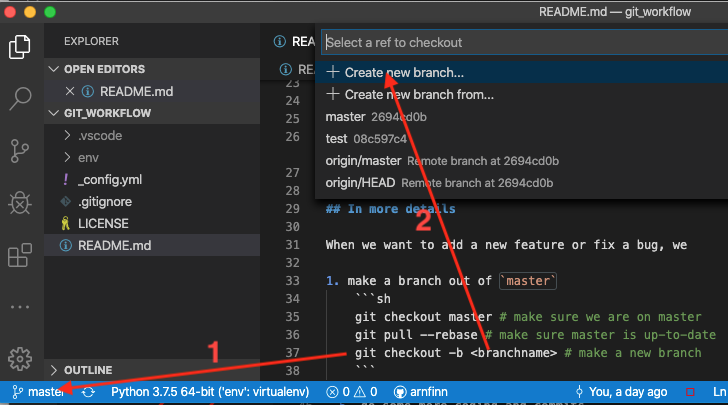
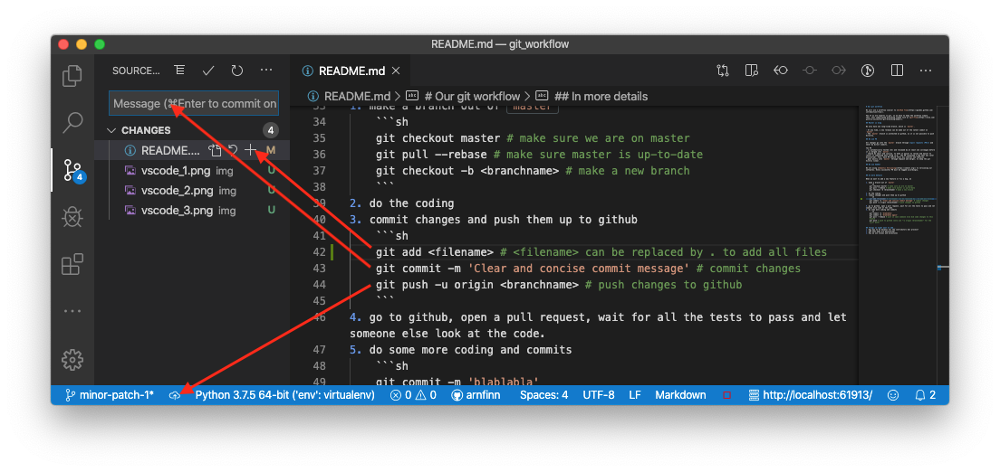

## Coding

### Make tests

"Untested code is broken code"

### Write short functions/modules

Break the code into small units

### DRY

Don't repeat yourself. Thus, do not copy-and-paste.

### Remove unused code and libraries

It will still be there, in the git history

### Refactor the code

Rewrite code, including other peoples code, to make it cleaner and easier to maintain.

### Make issues

If you find a bug or are thinking of a new feature, make an issue. If you will fix the bug or implement the new feature, assign yourself to the issue.

## Our git workflow

We will use a workflow similar to [GitHub flow](https://guides.github.com/introduction/flow/).

Few of us are experts in git, so we have to keep the workflow simple.
Thus, *no* complicated branching scheme such as [git-flow](https://nvie.com/posts/a-successful-git-branching-model/).

### Master is king

We only have one long-lived branch, which is `master`.

- At any time, a new release can be made out of the latest commit on `master`.
- The `master` branch is protected on github, so it is not possible to push directly.

### We use PR

All changes go into the `master` branch through **pull requests (PR)** and never by direct commits.

The PR
- is automatically tested (CI) and reviewed by at least one colleague before it is merged into `master`.
- should be small and concise, to make it easier to review and easier to revert if something went wrong (e.g., the PR contained a bug that was later discovered). Thus, each PR should *not* mix several new features.
- goes mainly into `master` through *Squash and merge*, to keep the git history linear.

### We use SemVer

We are using [Semantic Versioning](https://semver.org/) to versioning our softwares. Every successful PR must be tagged accordingly.


### In more details

When we want to add a new feature or fix a bug, we

1. make a branch out of `master`
    
    **terminal**
    ```sh
    git checkout master # make sure we are on master
    git pull --rebase # make sure master is up-to-date
    git checkout -b <branchname> # make a new branch
    ```
    **vscode**

    

    
2. do the coding
3. commit changes and push them up to github
   
   **terminal**
    ```sh
    git add <filename> # <filename> can be replaced by . to add all files
    git commit -m 'Clear and concise commit message' # commit changes
    git push -u origin <branchname> # push changes to github
    ```
    **vscode**

    
4. go to github, open a pull request, wait for all the tests to pass and let someone else look at the code.
5. do some more coding and commits
    ```sh
    git commit -m 'blablabla'
    git commit -m 'blablabla again'
    git pull --rebase # just in case someone else did some changes to this branch
    git push # push to github (only use "-u origin <branchname>" for the first push)
    ```

## Things we might want to add...
1. How may CI be helpful for the contributors dev process?
1. SOP when bugs are descovered?
1. How we use issues and milestones

